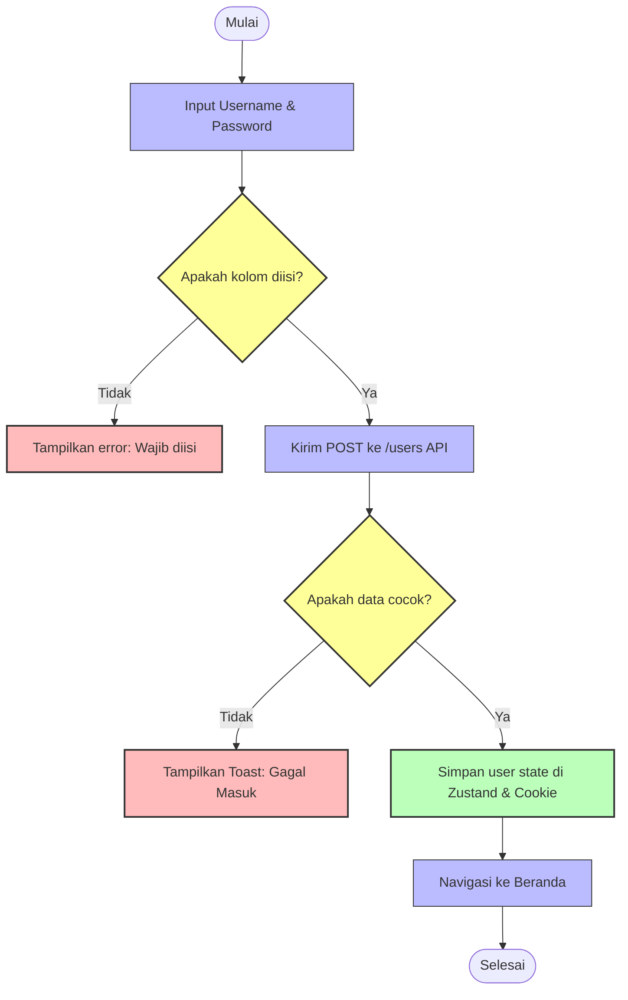
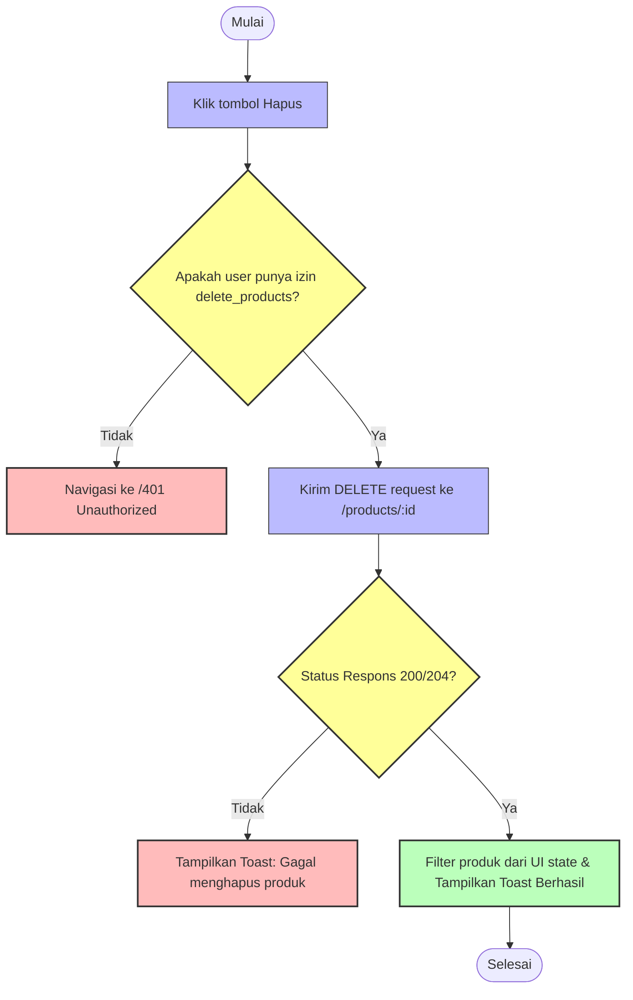

# Business Process MVP

_Version: 1.0 | Last Updated: 2026-06-22 | Sources: auth.ts, products.ts, useAuthStore.ts_

This document details the core lifecycles of the application using styled Mermaid diagrams and detailed process explanations.

---

## 🔑 1. User Authentication Lifecycle

This flowchart describes the path of a user attempting to log in, from request verification to storing session cookies and initializing navigation states.

### System Decisions & Integration Seams
- **Cookie Setup**: The access token is saved in secure cookies on the client side, allowing subsequent Axios requests to be intercepted and injected with `Authorization: Bearer <token>`.
- **Zustand Auth Sync**: The `useAuthStore` status is updated to `isAuthenticated = true` and `user` profile is loaded.

---

## 📦 2. Product Deletion Lifecycle

This flowchart details how product deletion requests are validated against permission tables before deleting resources.

### System Decisions & Integration Seams
- **Zustand Guard Checks**: The application leverages `hasPermission(PERMISSIONS.DELETE_PRODUCTS)` dynamically from the global auth store state before initiating the Axios request.
- **Optimistic UI Update**: Upon receiving an HTTP 200/204 status code, the React state is updated to filter out the deleted ID to reflect the change immediately in the viewport.
