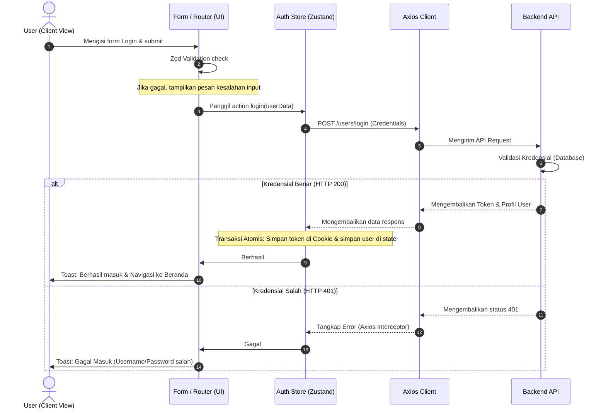

# Activity Diagram MVP

_Version: 1.0 | Last Updated: 2026-06-22 | Sources: login.tsx, axios.ts, useAuthStore.ts_

This document presents a step-by-step activity diagram showing control flows across different application layers, illustrating validation loops and integrations.

---

## 🔒 Login Session Initialization Flow

The diagram below details the swimlanes representing the **User (UI)**, the **Browser Router**, the **Zustand Auth Store / Axios Interceptors**, and the **Remote API**.

### Key Validation & Integration Details
1. **Client-Side Zod Check**: Before hitting the store actions, form data is validated against the login schema. Invalid fields prevent any network requests.
2. **Atomic Session Initialization**: The cookie saving step and store setting step execute together. If cookie writing fails, the state is cleared, preventing a half-logged-in application state.
3. **Axios Interception**: The Axios response interceptor logs responses in development mode and forwards authentication failures cleanly to the UI layer.
