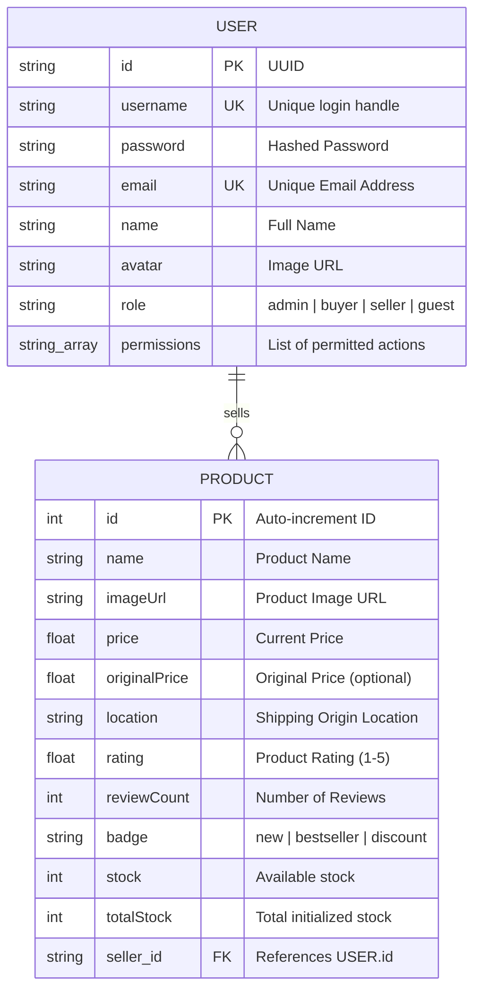

# Database Schema MVP

_Version: 1.0 | Last Updated: 2026-06-22 | Sources: user.ts, product.ts_

This document details the database schema and model mappings used by the application, visualized with a Mermaid Entity Relationship Diagram (ERD).

---

## 📊 Entity Relationship Diagram (ERD)

---

## 📝 Schema Fields Definition & Types

### 1. USER Entity
- **id**: A unique identifier, typically standard UUID.
- **username**: Unique handle used during login.
- **permissions**: Represented as a list of strings (e.g. `["view_dashboard", "view_products"]`) enabling roles and permissions matching.
- **role**: Defines access level. Main roles map to `admin`, `buyer`, `seller`, and `guest`.

### 2. PRODUCT Entity
- **id**: Unique numeric identifier.
- **badge**: A JSON object or structured enum representing marketing tags (e.g. `{ type: "discount", value: 20 }`).
- **seller_id**: Foreign key mapping a product to the user profile who uploaded it. Enables Seller Center isolation logic.
