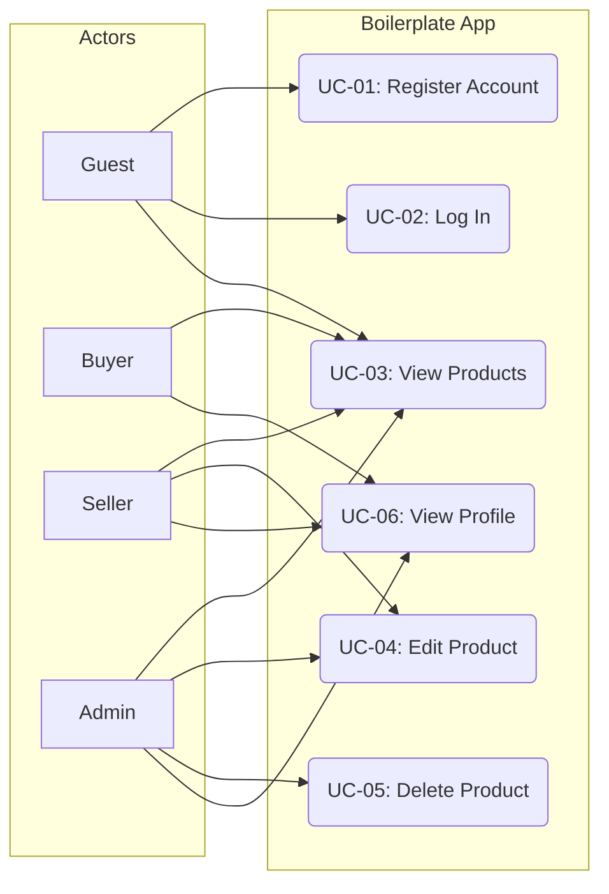

# Use Case Narrative

_Version: 1.0 | Last Updated: 2026-06-22 | Sources: roles.ts, product-list.tsx_

This document specifies the system actors, use cases, and boundaries of the application.

---

## 👥 System Actors

1. **Guest**: An unauthenticated user browsing public landing pages.
2. **Buyer**: An authenticated user with permissions to view products and dashboards.
3. **Seller**: An authenticated merchant with permissions to manage products via the Seller Center.
4. **Admin**: A system administrator with all privileges, including product deletion.

---

## 📋 Use Case Mapping

| UC ID | Use Case Name | Primary Actor | Description |
|---|---|---|---|
| **UC-01** | Register Account | Guest | Create a new user profile choosing a role (Buyer/Seller). |
| **UC-02** | Log In | Guest | Log in using credentials to retrieve access tokens. |
| **UC-03** | View Products | Guest, Buyer, Seller, Admin | Browse the product listing page. |
| **UC-04** | Edit Product | Seller, Admin | Edit description, price, stock, or badge details of products. |
| **UC-05** | Delete Product | Admin | Remove products from the catalog. |
| **UC-06** | View Profile | Buyer, Seller, Admin | View account details and avatar. |

---

## 🗺️ Use Case Relationships

This diagram maps how actors interact with the system actions:

