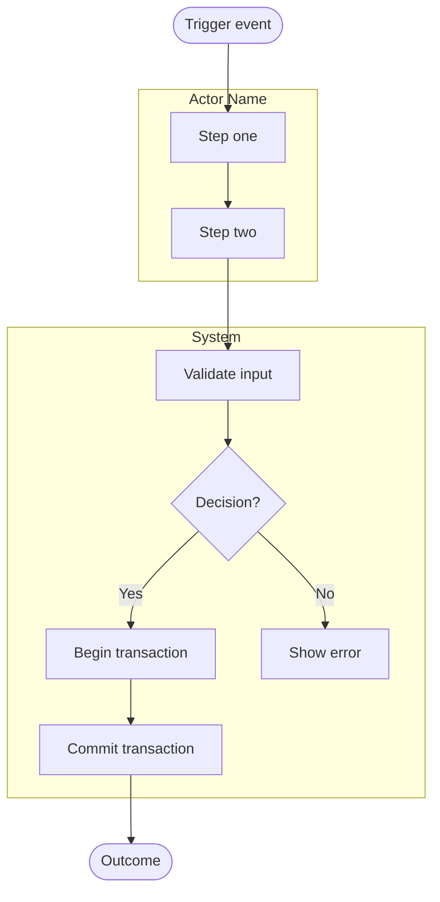
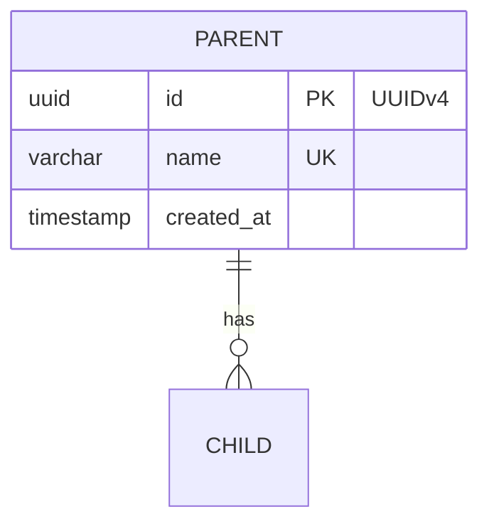

# Mermaid Diagram Standards

All diagrams in this project are written in Mermaid syntax and rendered via
[mermaid.live](https://mermaid.live) or any Mermaid-compatible viewer (GitHub,
VS Code extension). This file defines the exact conventions to follow when generating
PRDs, ERDs, business process flows, and activity diagrams.

---

## Rendering target

Always use **[mermaid.live](https://mermaid.live)** as the primary rendering provider.
Every diagram block must be pasteable into mermaid.live without modification and render
correctly. Do not use Mermaid syntax that is unsupported by mermaid.live.

---

## Diagram type selection

| Document type                        | Mermaid diagram type                         | Directive                                          |
| ------------------------------------ | -------------------------------------------- | -------------------------------------------------- |
| ERD / Data model                     | `erDiagram`                                  | Use crow's-foot notation                           |
| Business process / cross-module flow | `flowchart TD` or `flowchart LR`             | Use `LR` for high-level lifecycle, `TD` for detail |
| Activity diagram / use case logic    | `flowchart TD` with subgraphs as actor lanes | Narrow and deep — one use case at a time           |
| Sequence / timing                    | `sequenceDiagram`                            | Only when timing between actors is the point       |
| State machine                        | `stateDiagram-v2`                            | Only for pure state transition reference           |

---

## Flowchart conventions (business process & activity diagrams)

### Shape vocabulary

| Shape          | Syntax                         | Use for                                   |
| -------------- | ------------------------------ | ----------------------------------------- |
| Pill / rounded | `([Text])`                     | Start event and end event of the flow     |
| Rectangle      | `[Text]`                       | Activities, system actions, steps         |
| Diamond        | `{Text}`                       | Decision points with two or more branches |
| Subgraph       | `subgraph LABEL[Display Name]` | Actor swim lanes in activity diagrams     |

### Arrow types

| Arrow         | Syntax | Use for                                             |
| ------------- | ------ | --------------------------------------------------- | --- | --------------------------------------- |
| Solid         | `-->`  | Normal next-step transitions                        |
| Labeled solid | `-->   | Label                                               | `   | Labeled branches from decision diamonds |
| Dotted        | `-.->` | Loop-backs, asynchronous returns, or optional paths |

### Subgraphs as actor lanes

Activity diagrams use subgraphs to represent actor swim lanes. Each actor gets one
subgraph. System logic gets its own `S[System]` subgraph. The connection arrows between
subgraphs are defined **outside** all subgraph blocks.



---

## Color coding — REQUIRED on every diagram

Apply `style` declarations to nodes that fall into these semantic categories.
Colors match the project's status palette used throughout the application UI.

| Semantic role                      | Color  | Hex       | Apply to                          |
| ---------------------------------- | ------ | --------- | --------------------------------- |
| Start / success end states         | Green  | `#ecfdf5` | `([Start])`, `([Success End])`    |
| Decision points / attention states | Yellow | `#fffbeb` | `{Decision}` nodes                |
| System transactional actions       | Blue   | `#eff6ff` | Begin/Commit transaction nodes, Atomic updates |
| Error states / terminal failures   | Red    | `#fef2f2` | Error nodes, rejection endpoints  |
| Passive / waiting / closed states  | Gray   | `#f1f5f9` | Neutral end states, closed states |

### Style syntax

```mermaid
    style NodeId fill:#ecfdf5
    style NodeId fill:#fffbeb
    style NodeId fill:#eff6ff
    style NodeId fill:#fef2f2
    style NodeId fill:#f1f5f9
```

**Rules:**
- Every start pill gets `fill:#ecfdf5`
- Every successful end pill gets `fill:#ecfdf5`
- Every error/rejection end gets `fill:#fef2f2`
- Every decision diamond gets `fill:#fffbeb`
- Every **Atomic Transaction** or major data mutation node gets `fill:#eff6ff`
- Passive or waiting end states get `fill:#f1f5f9`
- Style declarations go at the BOTTOM of the diagram block, after all connections.

---

## ERD conventions (erDiagram)

### Entity block structure

List every column with:
- Data type (`uuid`, `int`, `varchar`, `decimal`, `boolean`, `timestamp`, `jsonb`)
- Constraint key: `PK` for primary key, `FK` for foreign key, `UK` for unique
- A quoted description string for enum columns, types, or special values.



---

## Document Structure Standards

### 1. Business Processes (`02_business_process_mvp.md`)
End-to-end business processes that the system supports across modules. High-level lifecycles.
*Requirement: Must explicitly mention cross-module integrations and how states change across domains.*

### 2. Activity Diagrams (`03_activity_diagram_mvp.md`)
UML-style activity diagrams using Mermaid flowchart syntax with subgraphs representing actor lanes.
*Requirement: Must explicitly show step-by-step logic, API/Webhook integrations, and "Atomic Transactions" where multiple database states change simultaneously (e.g., `Order: PAID` and `Invite: PUBLISHED`). Use the blue `#eff6ff` color for these critical system nodes.*

### 3. Use Case Narrative (`05_use_case_diagram.md`)
Must define the **Actors**, list the **Use cases by module** with explicit IDs (e.g., `UC-INV-01: Create Invitation`), and map the actors to system actions in the Mermaid `flowchart LR` diagram.

---

## Common mistakes to avoid
1. **Omitting style declarations** — every diagram must include color styles.
2. **Missing Atomic Transactions** — failing to explicitly group concurrent database updates into a single transactional node in Activity Diagrams.
3. **Defining connections inside subgraphs** — connections between nodes in different subgraphs must be written OUTSIDE all subgraph blocks.
4. **Vague feature lists** — failing to break down features to the screen/module level in `01_feature_list_mvp.md`.